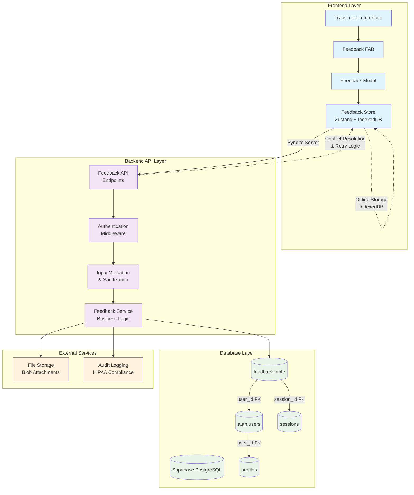
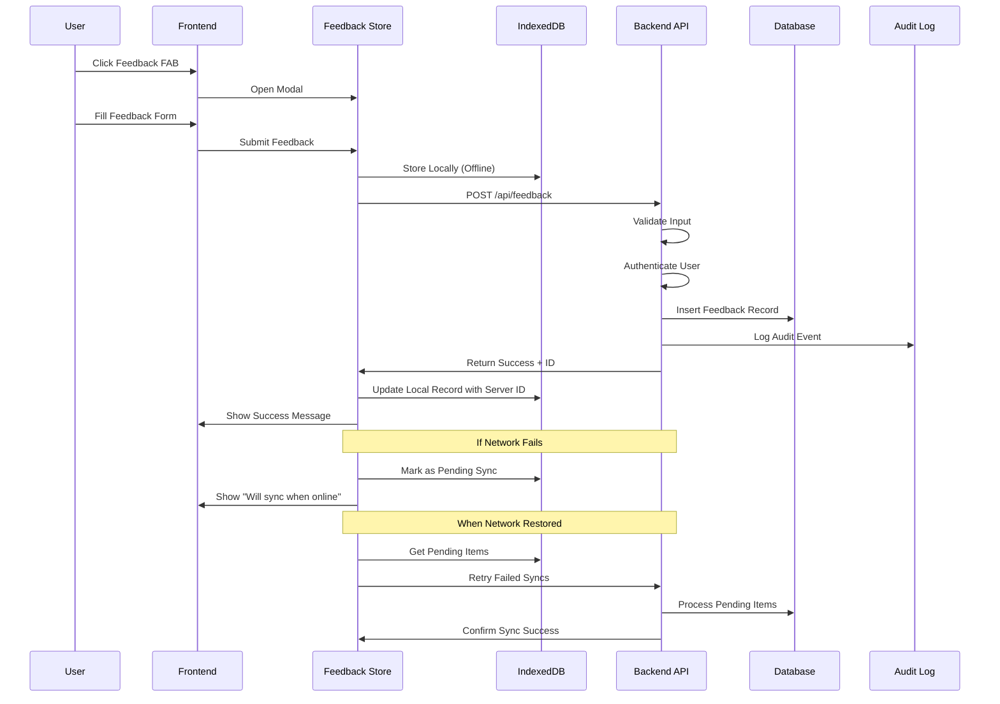
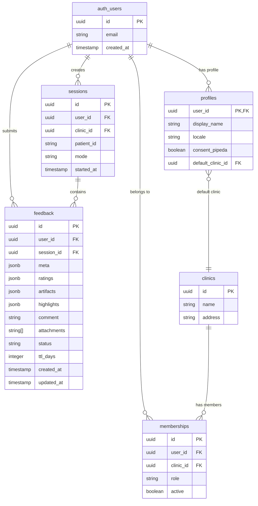
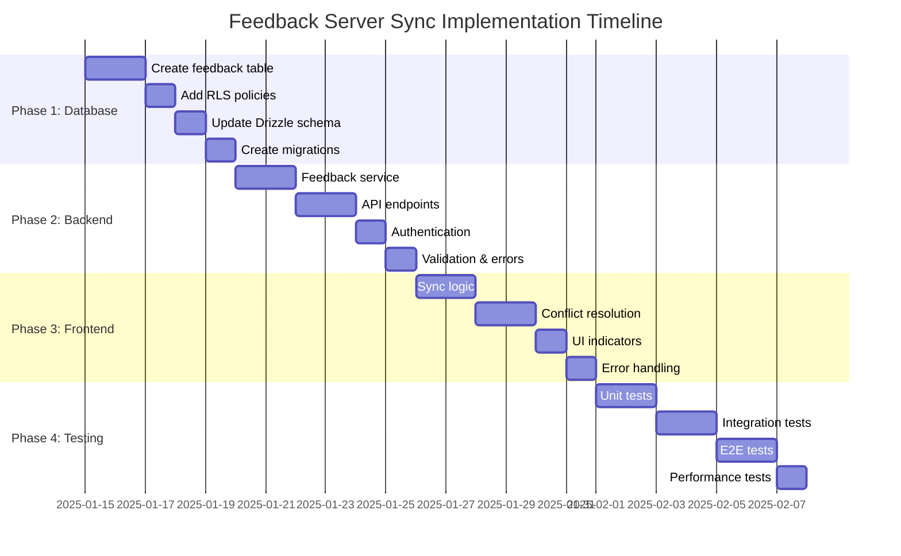

# Feedback Server Sync Architecture Flowchart

## System Architecture Overview



## Feedback Data Flow



## Database Schema Design



## Implementation Phases



## Key Implementation Details

### 1. Database Schema
```sql
CREATE TABLE public.feedback (
    id uuid PRIMARY KEY DEFAULT gen_random_uuid(),
    user_id uuid NOT NULL REFERENCES auth.users(id) ON DELETE CASCADE,
    session_id uuid REFERENCES public.sessions(id) ON DELETE SET NULL,
    meta jsonb NOT NULL,
    ratings jsonb NOT NULL,
    artifacts jsonb,
    highlights jsonb DEFAULT '[]',
    comment text,
    attachments text[] DEFAULT '{}',
    status text DEFAULT 'open' CHECK (status IN ('open', 'triaged', 'resolved')),
    ttl_days integer DEFAULT 30,
    created_at timestamptz NOT NULL DEFAULT now(),
    updated_at timestamptz NOT NULL DEFAULT now()
);
```

### 2. Row Level Security
```sql
-- Enable RLS
ALTER TABLE public.feedback ENABLE ROW LEVEL SECURITY;

-- Users can only see their own feedback
CREATE POLICY "users_can_view_own_feedback" ON public.feedback
    FOR SELECT USING (user_id = auth.uid());

-- Users can insert their own feedback
CREATE POLICY "users_can_insert_own_feedback" ON public.feedback
    FOR INSERT WITH CHECK (user_id = auth.uid());

-- Users can update their own feedback
CREATE POLICY "users_can_update_own_feedback" ON public.feedback
    FOR UPDATE USING (user_id = auth.uid());
```

### 3. API Endpoints
- `POST /api/feedback` - Create new feedback
- `GET /api/feedback` - List user's feedback
- `GET /api/feedback/:id` - Get specific feedback
- `PUT /api/feedback/:id` - Update feedback
- `DELETE /api/feedback/:id` - Delete feedback
- `POST /api/feedback/sync` - Sync pending items

### 4. Sync Strategy
- **Offline First**: Store in IndexedDB immediately
- **Background Sync**: Sync to server when online
- **Conflict Resolution**: Server wins, merge metadata
- **Retry Logic**: Exponential backoff for failed syncs
- **Status Tracking**: Track sync status per item

### 5. Compliance Considerations
- **HIPAA**: No PHI in feedback content
- **PIPEDA**: User consent for data collection
- **Law 25**: Quebec privacy compliance
- **Audit Logging**: Track all feedback operations
- **Data Retention**: TTL-based cleanup (30 days default)
