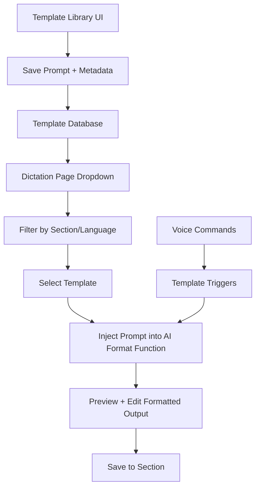

# Template Library → Dictation Integration Implementation Plan

## 🎯 Objective

Enable dynamic template selection and AI formatting in the Dictation module by:

- Centralizing template creation & management via `/templates`
- Dynamically populating the "Select Template" dropdown in the Dictation page with relevant entries
- Allowing templates to be tied to Sections (7, 8, 11, etc.)

## 📊 Current Architecture Analysis

### ✅ **Aligned Components**
- **Backend Schema**: Existing `templates` table in `backend/src/database/schema.ts` with proper structure
- **Template Service**: `TemplateService` class already implemented in `backend/src/services/templateService.ts`
- **Type Definitions**: Template interfaces defined in both frontend and backend
- **Existing Templates**: CNESST section templates (7, 8, 11) already created in `backend/templates/`
- **Frontend Structure**: React + TypeScript + shadcn/ui architecture supports the proposed components

### 🔄 **Schema Alignment**
**Current Schema** (from `backend/src/database/schema.ts`):
```typescript
export const templates = pgTable('templates', {
  id: uuid('id').primaryKey().defaultRandom(),
  section: text('section', { enum: ['section_7', 'section_8', 'section_11'] }).notNull(),
  name: varchar('name', { length: 255 }).notNull(),
  description: text('description'),
  content: text('content').notNull(),
  language: text('language', { enum: ['fr', 'en'] }).notNull().default('fr'),
  version: varchar('version', { length: 50 }).notNull().default('1.0.0'),
  is_active: boolean('is_active').notNull().default(true),
  voice_commands: json('voice_commands'),
  created_at: timestamp('created_at').defaultNow().notNull(),
  updated_at: timestamp('updated_at').defaultNow().notNull(),
});
```

**Proposed Schema Enhancement**:
```typescript
// Additional fields to add:
tags: text('tags').array(), // For categorization
prompt: text('prompt'), // AI formatting prompt
created_by: uuid('created_by').references(() => users.id), // User ownership
is_default: boolean('is_default').default(false), // Default template flag
status: text('status', { enum: ['active', 'inactive', 'draft'] }).default('active'),
```

### 🎯 **Integration Points**
- **TranscriptionInterface.tsx**: Main dictation component ready for template dropdown
- **SectionSelector.tsx**: Already handles section selection logic
- **TemplateService.ts**: Backend service ready for CRUD operations
- **Voice Commands**: Existing system can integrate with template triggers

## 📦 Backend Implementation

### **Template JSON Format Specification**
```typescript
interface TemplateJSON {
  section: "7" | "8" | "11";           // CNESST section number
  title: string;                       // Template title/name
  content: string;                     // Template content with placeholders
  tags: string[];                      // Categorization tags
  source_file: string;                 // Original .docx file for traceability
  language?: "fr" | "en";              // Language (default: fr)
  category?: string;                   // Template category
  complexity?: "low" | "medium" | "high"; // Complexity level
}

// Example Template JSON:
{
  "section": "8",
  "title": "Diagnostic - Entorse lombaire",
  "content": "Le travailleur présente une entorse lombaire sévère selon le rapport du [date]...",
  "tags": ["entorse", "lombaire", "diagnostic"],
  "source_file": "204_MS2-2-5-conso.docx"
}
```

### **Enhanced Template Schema (Phase 2)**
```typescript
interface EnhancedTemplate {
  id: string;
  name: string;
  section: 'section_7' | 'section_8' | 'section_11';
  language: 'fr' | 'en';
  status: 'active' | 'inactive' | 'draft';
  tags: string[];
  prompt: string; // AI formatting instructions
  created_by: string;
  is_default: boolean;
  content: {
    structure: TemplateStructure;
    voice_commands: VoiceCommand[];
    formatting_rules: Record<string, any>;
    validation_rules: Record<string, any>;
  };
  created_at: Date;
  updated_at: Date;
}
```

### **API Endpoints to Implement**
```typescript
// Template Management
GET /api/templates - List all templates (with filtering)
POST /api/templates - Create new template
PUT /api/templates/:id - Update template
DELETE /api/templates/:id - Delete template
GET /api/templates/:id - Get template details

// Template Selection for Dictation
GET /api/templates/active?section=section_7&language=fr - Get active templates for section
POST /api/templates/:id/activate - Set template as active
POST /api/templates/:id/deactivate - Set template as inactive
```

### **Database Migration Strategy**
1. **Phase 1**: Add new fields to existing `templates` table
2. **Phase 2**: Migrate existing JSON templates to enhanced schema
3. **Phase 3**: Implement RLS policies for user-specific templates

## 🧩 Frontend Modules

### **1. Template Library Page (`/templates`)**

#### **TemplateLibrary.tsx** - Main container
```typescript
// Features:
- Template grid/list view
- Search and filtering
- Bulk operations
- Template preview
- Import/export functionality
```

#### **TemplateListSidebar.tsx** - Navigation
```typescript
// Features:
- Section-based filtering (7, 8, 11)
- Language filtering (FR/EN)
- Status filtering (Active/Inactive/Draft)
- Tag-based filtering
- Favorites/Recently used
```

#### **TemplateDetailPanel.tsx** - Editor
```typescript
// Features:
- Template metadata editing
- Content structure editor
- Voice command configuration
- Prompt editor for AI formatting
- Preview mode
- Version history
```

### **2. Dictation Page Integration**

#### **TemplateDropdown.tsx** - New component
```typescript
interface TemplateDropdownProps {
  currentSection: "7" | "8" | "11";
  currentLanguage: 'fr' | 'en';
  onTemplateSelect: (template: TemplateJSON) => void;
  selectedTemplate?: TemplateJSON;
}

// Features:
- Load templates from /template-library/json/[section]/
- Show template title + tags
- Template content preview on hover
- Quick template switching
- Content injection into dictation field
- Filter by tags or title
```

#### **Integration with TranscriptionInterface.tsx**
```typescript
// Add to existing component:
const [selectedTemplate, setSelectedTemplate] = useState<TemplateJSON | null>(null);

// Template selection handler
const handleTemplateSelect = (template: TemplateJSON) => {
  setSelectedTemplate(template);
  // Inject template.content into dictation field
  injectTemplateContent(template.content);
  // Apply CNESST formatting rules
  formatWithCNESSTRules(template.content);
};
```

## 🪜 Phase Implementation Plan

### **Phase 1: Template Library System & Dictation Integration (Week 1-2)**

#### **Template Library Structure:**
```
/template-library/
│
├── /json/
│   ├── section7/          # ✅ Already processed
│   ├── section8/          # 🔄 To extract from 22 .docx files
│   └── section11/         # 🔄 To extract from 22 .docx files
│
├── parse/
│   └── docx_to_template_json.py
│
├── ui/
│   └── TemplateDropdown.tsx
│
├── index.ts (for registering templates)
└── README.md
```

#### **Backend Tasks:**
- [ ] Create template parsing system for .docx files
- [ ] Extract Section 8 & 11 templates from 22 CNESST reports
- [ ] Generate JSON-formatted templates following spec
- [ ] Implement template registration system
- [ ] Add template validation logic

#### **Frontend Tasks:**
- [ ] Create `TemplateDropdown.tsx` component
- [ ] Integrate dropdown into existing Dictation UI
- [ ] Implement dynamic template loading by section
- [ ] Add template content injection functionality
- [ ] Implement template filtering by tags/title

#### **Integration Tasks:**
- [ ] Connect dropdown to template library JSON files
- [ ] Implement template selection and content injection
- [ ] Add template preview functionality
- [ ] Test template formatting compliance
- [ ] Validate CNESST formatting standards

### **Phase 2: Advanced Template Management (Week 3)**

#### **Frontend Tasks:**
- [ ] Create `/templates` route and page structure
- [ ] Build `TemplateLibrary.tsx` with template management UI
- [ ] Implement `TemplateListSidebar.tsx` with filtering
- [ ] Create `TemplateDetailPanel.tsx` for editing
- [ ] Add template preview and testing functionality

#### **Backend Tasks:**
- [ ] Enhance `TemplateService` with CRUD operations
- [ ] Add new API endpoints for template management
- [ ] Implement template search and filtering
- [ ] Add template versioning system

#### **Integration Tasks:**
- [ ] Connect frontend to backend API endpoints
- [ ] Implement template CRUD operations
- [ ] Add template validation and error handling
- [ ] Test template creation and editing flow

### **Phase 3: Supabase Integration (Week 4-5)**

#### **Database Tasks:**
- [ ] Create database migration for enhanced schema
- [ ] Implement RLS policies for template access
- [ ] Migrate existing templates to new schema
- [ ] Add user-specific template ownership

#### **Backend Tasks:**
- [ ] Replace local storage with Supabase queries
- [ ] Implement user authentication for templates
- [ ] Add template sharing and collaboration features
- [ ] Implement template versioning

#### **Frontend Tasks:**
- [ ] Update components to use Supabase data
- [ ] Add user-specific template management
- [ ] Implement template sharing UI
- [ ] Add template version history display

## 💡 UX Enhancements (Optional)

### **Template Management UX:**
- [ ] Add badges for language, section, default status
- [ ] Implement tag filtering with multi-select
- [ ] Add template favorites system
- [ ] Show template usage statistics
- [ ] Add template import/export functionality

### **Dictation Integration UX:**
- [ ] Save most-used template to localStorage
- [ ] Show inline preview of template prompt
- [ ] Add template switching keyboard shortcuts
- [ ] Implement template suggestions based on context
- [ ] Add template performance metrics

## 🔗 Integration Flow



## 🎯 Success Metrics

### **Phase 1 Success Criteria:**
- [ ] 22 .docx files successfully parsed for Section 8 & 11 templates
- [ ] JSON-formatted templates generated and stored in `/template-library/json/`
- [ ] TemplateDropdown component integrated into Dictation UI
- [ ] Template content injection working with CNESST formatting
- [ ] Dynamic template loading by section (7, 8, 11)

### **Phase 2 Success Criteria:**
- [ ] Template library management UI accessible at `/templates`
- [ ] CRUD operations working for templates
- [ ] Template filtering by section/language/tags
- [ ] Template preview and testing functionality
- [ ] Template versioning system implemented

### **Phase 3 Success Criteria:**
- [ ] Supabase integration complete for template storage
- [ ] User-specific templates working with RLS policies
- [ ] Template sharing and collaboration features
- [ ] Production-ready with full template lifecycle management

## 🚀 Implementation Priority

### **High Priority (Phase 1):**
1. Parse 22 .docx files for Section 8 & 11 templates
2. Generate JSON-formatted templates
3. Create TemplateDropdown component
4. Integrate dropdown into Dictation UI
5. Implement template content injection

### **Medium Priority (Phase 2):**
1. Template library management UI
2. Advanced filtering and search
3. Template preview functionality
4. Template versioning system

### **Low Priority (Phase 3):**
1. Supabase integration for template storage
2. User-specific templates
3. Template sharing and collaboration
4. Advanced analytics and usage tracking

---

## 📋 Technical Debt & Considerations

### **Current Technical Debt:**
- Template content stored as JSON string in database
- No template versioning system
- Limited template validation
- No user-specific template ownership

### **Phase 1 Specific Considerations:**
- Template parsing from .docx files requires robust error handling
- JSON template format must maintain CNESST formatting compliance
- Template content injection must preserve markdown and line breaks
- Dynamic template loading must be performant for real-time dictation

### **Future Considerations:**
- Template performance optimization
- Template caching strategy
- Template backup and recovery
- Template analytics and insights
- Integration with AI formatting pipeline

---

*Document Version: 1.0*  
*Last Updated: 2024-01-01*  
*Status: Ready for Implementation*
